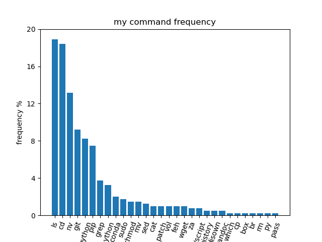

# welcome to the terminal 
### contents
- using this tutorial
- command structure
- getting help
- useful syntax & keybindings
- navigating filesystems
- running programs
- editing programs
- installing anaconda python

## using this tutorial
```git clone https://github.com/jamesengleback/terminal-adventures.git```

```cd terminal-adventures```

## command structure
```prompt``` ```program``` ```options``` ```file input```

### e.g. open film.mp4 with vlc media player
```[user@machine][~/Documents] $ vlc film.mp4```

options to programs are usually specified with ```-<letter>``` or ```--<word-no-spaces>```

### e.g. convert readme.md to readme.pdf using [pandoc](https://pandoc.org/)

```[james@thinkpad] [~] ❱❱ pandoc -i readme.md -o readme.pdf --pdf-engine=xelatex```

- ```-i <input-file>``` - input file types are inferred from the extension, but if needed a file reader can be specified like this: ```-r markdown``` - see the ```man``` page for other file types that can be read
- ```-o <output-file-name>``` - file type is inferred from the file extension again, but can be specified with ```-w pdf```
- ```--pdf-engine=xelatex``` is a multi-letter option, which needs to be specified with two dashes ```--```. It specifies a non-default pdf engine for pandoc. that was necessary because LaTex, the default pdf engine in this case does not support unicode character U+2771 ```❱```. an error message from running ``` pandoc -i readme.md -o readme.pdf``` provides this information. 

# getting help
although options vary between programs, most programs have the option ```--help``` - which shows options. 
**try this:** browse the help sections for these common programs:
* ```ls```
* ```cd```
* ```cat```
* ```head```

## ```man```
```man``` is a program that displays a manual page for programs that have manuals. The manuals are generally comprehensive & concise, & can be all you need to learn about program. Bye google! try some of these:
* ```man man```
* ```man python```
* ```man ipython```
```man``` uses ```less``` as a page viewer by default. ```q``` to quit, ```h``` for info on more commands, including how to search text.

## ```info``` 
```info <command>``` gives documentation for a command in Info (short) format

# viewing files
there are pleny of ways to view files in the terminal. the most simple are:
- ```cat```: prints file contents into ```stdout```, can be used with multiple files. output can be redirected to a file like this: ```cat readme.md > newfile``` and appended to an existing file like this: ```cat readme.md >> existingfile```
- ```less``` scrollable view of a text file. can accept input from ```stdin``` like this: ```cat commands | less ``` 
- ```more``` scroll-less view of a text file - ```<enter>``` to advance


# editing files
the obvious way to edit a file is with a text editor like ```nano``` or ```vim```, both of which can open in the terminal. if you're not working remotely, then you can open your file with with a graphical text editor like [atom](). 
- ```nano```
- ```vim``` - vim is a famous text editor that has stood the test of time. It has a million hot keys and commands that minimise the number of keystrokes required for operations. It also has a fairly steep learning curve! Some users struggle to exit vim when it opens for the first time. To exit: press ```<esc>``` to ensure that ```vim``` is in command mode, ```:``` to open a command prompt at the foot of the page: ```q```  quit ; ```wq``` write & quit ; ```q!``` quit & discard changes
# operators

## useful syntax & keybindings
* ```clear``` or ```ctrl + l``` - clear text on screen
* ```↑``` go up through command history
* ```history``` show command history
* ```!<command-history-number>``` run a command in history
* ```htop``` - show system stats & processes (if htop is installed) - ```q``` to quit
* ```<command> &``` run the command in the background - useful for commands that take a long time!
* ```ctrl + c``` - cancel command
* ```ctrl + shift + c``` copy text to clipboard - ```ctrl + shift + v``` to paste
* ```<tab>``` - autocomplete!! if there is > 1 possible ending to the word (e.g. a program or file path) then double tap to see options
* ```*``` - wild card character. e.g. ```ls *.py``` will list any file that ends in ```.py``` 

# common commands

you don't need many commands to get by

## navigating filesystems
in unix systems, files are organized into a tree. check out the structure of this file system by running ```tree``` (if installed) in this file system. the directory our shell is "in" is generally shown in the prompt. we can also check where we are by running ```pwd``` (print working directory). 
* **ls** - use ```ls``` to see the contents of the directory we're in, and ```ls -a``` to see hidden files (which start with a ```.```) ```ls -l``` shows us the long listing format of the files, which includes the permissions of the files (who can read, edit or execute), the file size in bytes (add the option ```-h``` to make the format more human readable), and the owners.
* **cd** - change directory. run ```cd <folder/directory>``` to change directory to a particular directory. ```cd ..``` takes us up a level in the file tree. we can jump to somewhere specific by specifying a full path like this: ```cd ~/terminal-adventures/maze/right``` - autocomplete comes in really handy here. ```cd``` with no arguments takes us home. home (aka ```~```) is at ```/home/<your-username>```. the tilde ```~``` is a useful shortcut to writing ```/home/<your-username>```. try going up a few levels with ```cd ..``` - what's above us? how far can we go? what's at the root of the file system? how can we get home?
* ```mkdir <new-dir-name>``` - makes a new directory. try making a ```documents``` folder. ```rmdir <dir-name>``` will remove an empty directory.
* ```rm <file>``` - remove file. use ```rm -r <directory>``` to recursively remove the contents of a directory (& the directory itself)
* ```cp <file-to-copy> <destination-name>``` - copy a file - what does the ```-r``` option do?
* ```mv <file-to-move> <destination>``` - move a file. also used to rename a file.
* ```file <file-name>```

# try this
## running programs
some programs are already executable. ```ls -l``` shows us what is executable, e.g.
```-rwxr-xr-x 1 james james 16600 Dec  4 11:14 hello``` **come back to this**
run an executable like this ```./hello``` (if it's in your working directory, otherwise just give the path to the executable like ```../hello```). 
```hello``` is a binary file. you can tell by running ```file hello```. use ```cat``` to output the contents of the file to the terminal - what does it look like? nice? how about if we run ```hexdump hello```? 

I've put another program in the file system - ```run-me.sh```. can you find it? run it! what happens? what sort of file is it? use ```cat <file>``` to show the contents. what language is it? 

running ```python``` files :snake: -- if we don't have a shebang specifying which python interpreter to use (sometimes we have a few different ones installed), we can run a python file like ```python file.py```
## writing and editing programs
usually it's more practical to edit programs on your desktop with your favourite text editor, then copy the file to a server to run it. we'll cover this next time.

there are a lots of terminal-based text editors available. the easiest to use is ```nano```. to use nano, run ```nano <file-name>``` to either open an existing file, or create a new one if it doesn't already exist. The file extension will help nano decide which syntax highlighting to use. Use the arrow keys to move around, ```ctrl + o``` to save and ```ctrl +x``` to exit.

there's a python file in this file system. it contains errors. find it, correct the errors and run it!

# session 2
### contents
- redirection and piping ```stdin``` ```stdout``` ```|``` ```>	``` ```>>```
- scp
- wget & curl
- anaconda

## redirection & piping


Quick definitions
- ```stdout``` - standard output of a program, by default it writes to the terminal. e.g. ```cat readme.md``` outputs the contents of ```readme.md``` to the terminal. ```stdout``` can be **redirected** to a file with the ```>``` (write) or ```>>``` (append) operators like this: ```cat readme.md > readme2.md``` (creates new file or overwrites an existing one, fills it with the output of ```cat readme.md```. to append to a file (add to the end without overwriting it) use ```>>```, e.g. ```echo "some more text >> readme2.md"``` redirects the output of the ```echo``` command (print) to append ```readme2.md```.
- ```stdin``` - standard input to a program when redirected from another program. Output from one program is **piped** into another using the ```|``` pipe operator. e.g. ```ls | wc``` redirects the output from ```ls``` (the directory listing) into ```wc``` - word count. Piping is a key feature of unix-based systems like mac and linux, it allows small, simple programs to work together effectively.

### aside: unix & the unix philosophy
unix was an early operating system developed in Bell Labs in the 1970's that emphasized minimal and modular programs that do one job well, and play together nicely. unix has had a huge impact on computing, today macOS and linux (& a few others) borrow heavily from unix. one product of the unix era was the POSIX standards - a standardisation of operating systems & shell interfaces to maintain compatibility between them.  Becasue of the POSIX standards, linux and macOS terminals are similar! read [the cathedral and the bazaar](http://www.catb.org/~esr/writings/cathedral-bazaar/) for insights to the unix philosophy ands open source software.

## some more handy commands
* ```find``` - **find files** - ```find . ``` will recursively list the files downstream from ```.``` --current directory - ```.``` can be replaced with any directory. Looking for something specific? try this: ```find . -name hello.py```. for broader searches, replacing ```-name``` with ```-iname``` renders the search case insensitive. the wildcard character ```*``` is useful here, it will match any number of any characters, so if we're looking for ```.py``` files then we can run ```find . -name *py```
* ```grep``` - regular expression search (text search) - ```grep unix readme.md``` will search and return all instances of "unixx" in the readme file. ```grep -i unix readme.md``` will make the search case insensitive. ```grep unix *``` will search for "unix" in all files in this directory. ```grep -r unix *``` will recursively search through directories and files for "unix". ```grep``` can read from stdin too, for example ```ls | grep readme```` will filter the results of ```ls``` by the search term "readme"


## ```curl``` & ```wget``` - download data
to download data from the internet, we'll need a URL client. ```curl``` (client-url) is a popular one and is installed by default on macOS and many linux systems. ```curl``` is like ```cat``` for urls, and will print the output to ```stdout``` unless specified otherwise (e.g. the ```-o <filename>``` flag lets the user set an output file). 

- try: ```curl wttr.in``` - what's that?

```wget``` is similar to ```curl``` in that it downloads resources from a URL. ```wget``` automatically creates a filename for the resource being downloaded, which is handy, otherwise, the output file can be specified with ```-o <filename>```. another useful feature of ```wget``` is the recursion option - ```-r``` , which will follow links in the download and download that too. It also has a ```--spider``` mode, which has it behave as a web spider - it maps out a site rather than downloading all the pages.

## anaconda
many operating systems have a version of python installed by default, run ```which python``` to find out where the default python binary is. if it's in ```/usr/bin``` then we're using the system's python.

anaconda is a distribution of python that comes with the ```conda``` package manager, which outperforms the default python package manager, ```pip``` in a few ways:
- ```conda``` manages conflicts (incompatibilities) in dependencies when installing a python package, whereas ```pip``` does not, and can lead to packages not working!
- ```conda``` can install non-python programs, like binaries. This is useful because some python programs are just interfaces to non-python programs.
- ```conda``` has a built-in environment manager. environments are fresh installs of python, isolated from your other environments. this is useful when using python packages that conflict with your day-to-day packages, or when checking out someone elses code.

## download and install anaconda
[this page](https://docs.conda.io/en/latest/miniconda.html) contains miniconda installers (minimal install anaconda) - use ```wget``` or ```curl``` to download a python 3 installer. It should give you a shell script. Take a look inside. execute this file to run the interactive installer.  

run ```which python``` again to see where we're running python from now. how about ```which python3```

## session 2 - challenge

- I've hidden the word ```SECRET``` in the maze somewhere - find it


## scp - secure copy
securely send files over a network via ```ssh```  - e.g. from your local machine to a remote one, or visa versa. 
## syntax
copy file to a remote host - path
```scp <path/to/local/file> [user@]host:[path/to/remote/copy]```

copy file from a remote host 
```scp [user@]host:[path/to/file] /path/to/destination```
